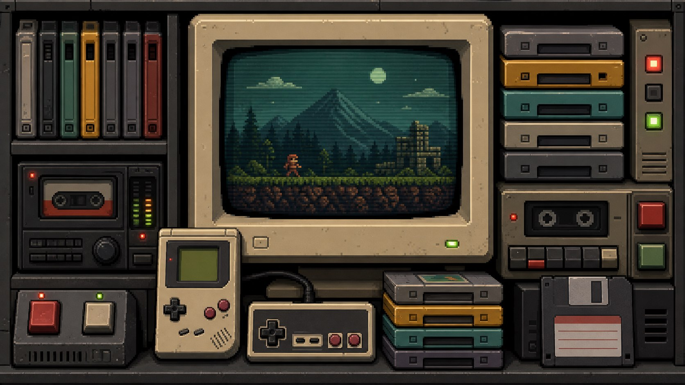

<p align="center">
  
</p>

<h1 align="center">NINGZHIHAN // SIGNAL RECEIVED</h1>

<p align="center">
  <code>retro-future tools</code> &nbsp;·&nbsp; <code>image systems</code> &nbsp;·&nbsp; <code>visual experiments</code>
</p>

```text
╔════════════════════ SIGNAL LOG ════════════════════╗
║  STATUS  : online                                   ║
║  SOURCE  : somewhere between analog and tomorrow    ║
║  MESSAGE : make useful things with a little static  ║
╚═════════════════════════════════════════════════════╝
```

## SELECT MODE

| CHANNEL | TRANSMISSION |
| :-- | :-- |
| `01 / IMAGE TOOL` | Small utilities for finding, viewing, and working with images. |
| `02 / VISUAL LAB` | Experiments in interfaces, signals, texture, and memory. |
| `03 / SIDE QUESTS` | Strange prototypes, unfinished sketches, and occasional ghosts in the machine. |

## CURRENT FREQUENCY

```text
█▓▒░  building quiet tools for visual work
░▒▓█  collecting low-resolution memories
█▓▒░  tuning the dial between nostalgia and new signals
```

<p align="center">
  <sub>INSERT COIN · KEEP SIGNAL ALIVE · NO SPOILERS FROM THE FUTURE</sub>
</p>
