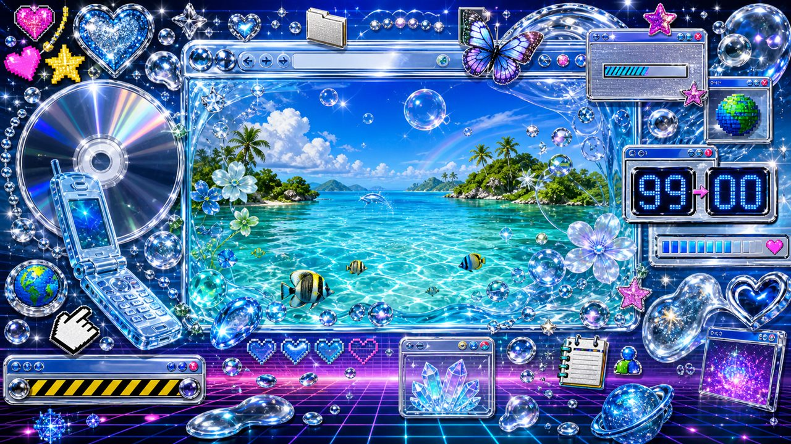

<a id="home"></a>

<p align="center">
  
</p>

<h1 align="center">NINGZHIHAN'S WORLD WIDE HOME</h1>

<p align="center">
  <code>personal homepage v2.000</code><br />
  best viewed with curiosity, glitter enabled, and one browser tab too many
</p>

<p align="center">
  <a href="#home">HOME</a> ::
  <a href="#aqua-zone">AQUA ZONE</a> ::
  <a href="#file-directory">FILE DIRECTORY</a> ::
  <a href="#system-status">SYSTEM STATUS</a> ::
  <a href="#guestbook">GUESTBOOK</a>
</p>

<p align="center">
  
</p>

> [!WARNING]
> **MILLENNIUM ROLLOVER ANOMALY** — System clock changed from `99` to `00`. Some memories may now appear brighter, wetter, or covered in glitter.

<table>
  <tr>
    <td width="55%" valign="top">
      <h3>WELCOME.TXT</h3>
      <p>You have reached a small personal node somewhere between the optimistic web, a flooded desktop, and a midnight synthesizer signal.</p>
      <p>This space collects image tools, visual experiments, interface fragments, and side quests that should probably have stayed in the downloads folder.</p>
    </td>
    <td width="45%" valign="top">
      <h3>NOW ONLINE</h3>
      <pre>USER     : NingzhiHan
MODE     : AQUA / GLITTER
LINK     : 56K SIMULATION
STATUS   : STILL LOADING
VISITOR  : #0002000</pre>
    </td>
  </tr>
</table>

## AQUA ZONE

```text
       .-.               .-.               .-.
    .-(   )-.         .-(   )-.         .-(   )-.
   (  LIQUID  )  ~~~ (  MEMORY  )  ~~~ (  SIGNAL  )
    '-(   )-'         '-(   )-'         '-(   )-'
       '-'               '-'               '-'
```

The interface is glossy because the future once looked clean. The water is clear because the internet once felt unexplored. The glitter is here because personal homepages were never meant to be quiet.

## FILE DIRECTORY

| FILE | TYPE | DESCRIPTION | STATE |
| :-- | :-- | :-- | :-- |
| `IMAGE_TOOLS.HTML` | utility | Small tools for finding, viewing, and working with images. | `[OPEN]` |
| `VISUAL_LAB.GIF` | experiment | Interfaces, textures, signals, bubbles, and browser memories. | `[LOOP]` |
| `SIDE_QUESTS.ZIP` | archive | Strange prototypes and unfinished ideas from another tab. | `[99%]` |
| `MIDNIGHT_FM.MP3` | transmission | Cyan, magenta, chrome, scanlines, and synthetic weather. | `[PLAY]` |

## SYSTEM STATUS

```text
[ OK ] AQUA ENGINE ................. water level stable
[ OK ] GLITTER RENDERER ............ sparkle cache full
[WARN] DATE MODULE ................. 12/31/99 -> 01/01/00
[ OK ] OLD WEB COMPATIBILITY ....... guestbook ready
[ .. ] FUTURE ...................... under construction
```

<details>
  <summary><b>[ click here to enter the hidden web ring ]</b></summary>

  <br />

  `BLINGEECORE` -> `FRUTIGER AERO` -> `SYNTHWAVE` -> `OLD WEB` -> `2000s INTERNET` -> `Y2K BUG` -> `HOME`

  <br />

  This ring has no beginning, no end, and at least three broken image links.
</details>

## GUESTBOOK

```text
+-----------------------------------------------------------+
| FROM: anonymous@internet                                  |
| DATE: 01/01/00                                            |
| MSG : cool page!!! keep the water running <3              |
+-----------------------------------------------------------+
```

<p align="center">
  <sub>HAND-CODED IN THE PERSONAL WEB ZONE // NO FLAT DESIGN DETECTED</sub><br />
  <sub>LAST UPDATED: WHEN THE CLOCK ROLLED OVER</sub>
</p>
